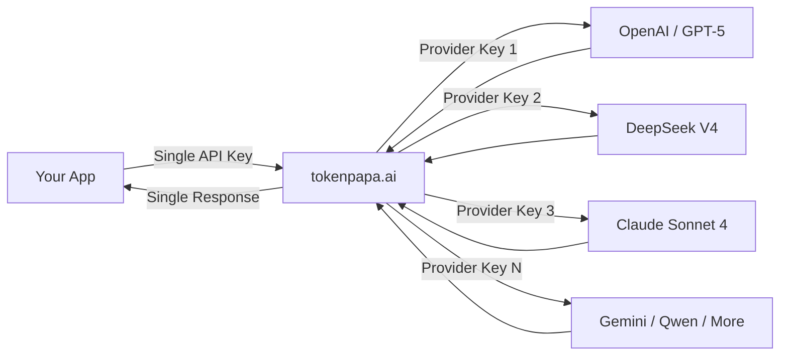

{/* GEO-optimized - 2026-06-28 */}

<JsonLd json='{"@context":"https://schema.org","@type":"Article","headline":"AI API Key Management & Security Best Practices (2026)","description":"AI API key security best practices for 2026. Protect your API keys, prevent unauthorized access, and manage multi-provider credentials securely with TokenPAPA.","datePublished":"2026-06-28","author":{"@type":"Organization","name":"TokenPAPA"}}' />

<JsonLd json='{"@context":"https://schema.org","@type":"FAQPage","mainEntity":[{"@type":"Question","name":"What happens if my AI API key gets leaked?","acceptedAnswer":{"@type":"Answer","text":"A leaked AI API key can result in unauthorized usage, unexpected billing charges (sometimes reaching thousands of dollars in hours), data exposure if the attacker reads your conversation history, and rate-limit exhaustion that blocks your legitimate application. Most AI API providers charge per-token and do not cap spending by default, making leaks extremely expensive. Immediate revocation via the provider dashboard is essential."}},{"@type":"Question","name":"How do I securely store multiple AI API keys?","acceptedAnswer":{"@type":"Answer","text":"The two best approaches are: (1) Use a unified API gateway like TokenPAPA that replaces 20+ individual keys with a single API key — drastically reducing your attack surface. (2) If managing keys individually, store them in environment variables (never in code), use a secrets manager like AWS Secrets Manager or HashiCorp Vault, add a .gitignore entry to prevent accidental commits, rotate keys every 90 days, and monitor per-key usage with alerts."}},{"@type":"Question","name":"Does TokenPAPA improve API key security?","acceptedAnswer":{"@type":"Answer","text":"Yes. TokenPAPA replaces 30+ provider-specific API keys with a single unified API key, dramatically reducing your key attack surface. It provides a centralized dashboard for usage monitoring and spending alerts, supports IP whitelisting, and lets you rotate one key instead of 20+. Since your underlying provider keys never reach your application or source code, the blast radius of any single leak is contained to a manageable, revocable proxy key."}}]}' />

# AI API Key Management & Security Best Practices (2026)

**Published: June 28, 2026** · **12 min read**

---

## 1. Introduction

Every day, developers accidentally expose AI API keys on GitHub, paste them into Slack messages, commit them to public repos, or leave them in client-side frontend code. The result? A single leaked key can rack up **thousands of dollars in unauthorized billing** in a matter of hours.

In 2025 alone, security researchers discovered over **12 million unique API keys and secrets** exposed in public GitHub repositories — and AI API keys accounted for a rapidly growing share. Unlike database credentials, which typically grant access to static data, AI API keys give attackers access to expensive compute resources. A single leak to a GPT-5 or DeepSeek V4 API key can trigger $10,000+ in charges before you even notice.

This guide covers the **5 essential best practices** for AI API key security in 2026, from foundational hygiene to enterprise-grade protection — and shows how **[TokenPAPA](https://tokenpapa.ai)** simplifies the entire equation.

> **The bottom line:** API key security is not optional. With token-based pricing and no built-in spending caps by default at most AI providers, a leak is not a hypothetical risk — it is a financial emergency waiting to happen.

---

## 2. Common Security Risks

Before we dive into solutions, let us look at the most common ways AI API keys get compromised.

### Key Exposure in Source Code

Hardcoding API keys directly in source files remains the #1 cause of leaks. A developer pushes code to GitHub, forgets to add the config file to `.gitignore`, and within minutes automated bots are scraping the exposed key. Tools like GitGuardian and truffleHog scan public repos continuously precisely because this is so common.

### Environment File Leaks

`.env` files are meant to keep secrets out of code — but they themselves get committed, shared via email, or pasted into issue trackers. A single `.env` file on a public repo can expose keys for multiple AI providers at once.

### Log Files and Error Outputs

API keys passed as query parameters in URLs, logged in structured logs, or printed in debug output end up in log aggregation systems (Datadog, Splunk, CloudWatch) where they can be accessed by anyone with log read permissions — often a much wider group than intended.

### Client-Side Exposure

Embedding API keys in frontend JavaScript, mobile app binaries, or browser extensions makes them trivially extractable. Any user can open developer tools or decompile your app to find the key.

### Third-Party Breaches

When you store API keys in shared services (CI/CD pipelines, collaboration tools, password managers shared across teams), a breach at any one of those services can expose all your keys simultaneously.

### The Shared Cost of Multi-Provider Management

Developers using **5-10 different AI providers** (OpenAI, DeepSeek, Anthropic, Google, Cohere, Mistral, etc.) end up managing that many separate API keys. Each key is an additional attack surface. Each provider has its own dashboard, its own key rotation flow, its own alerting system (or lack thereof). Managing 10+ keys significantly increases the probability that at least one will be mishandled.

---

## 3. Best Practice #1: Use a Unified API Gateway to Minimize Key Surface

The most effective way to reduce API key risk is to **reduce the number of keys you manage**. Every key you eliminate is one less key that can be leaked, stolen, or mishandled.

### The Single-Key Approach

A unified API gateway like **[TokenPAPA](https://tokenpapa.ai)** replaces 30+ provider-specific API keys with a single API key. Your application only ever stores and transmits one credential.



**Why this helps security:**
- **Your underlying provider keys never reach your application code.** They live only inside the gateway, reducing exposure points.
- **Key rotation becomes a single operation.** Rotate one gateway key instead of 20+ individual provider keys.
- **The blast radius of a leak is contained.** A leaked gateway key can be revoked instantly, and none of your upstream provider accounts are exposed.

### Comparison: Managing Keys Directly vs. Using a Gateway

| Aspect | Direct Multi-Key Management | TokenPAPA Gateway |
|--------|:---------------------------:|:-----------------:|
| **API keys to manage** | 10–30+ | **1** |
| **Dashboards to monitor** | 10–30+ | **1** |
| **Rotation frequency needed** | Per key (cumbersome) | Single rotation |
| **Provider keys in source code** | All 10+ | **None** |
| **Key leak blast radius** | One provider per key | Contained to proxy key |
| **Spending visibility** | Fragmented across providers | **Unified dashboard** |

For a full comparison of available models and providers on the gateway, see our [Flagship LLM Comparison 2026](/en/docs/blog/flagship-llm-comparison-2026).

---

## 4. Best Practice #2: Environment Variables & .gitignore

Whether you use a gateway or manage keys directly, **never hardcode API keys in source files**.

### The Right Way

```bash
# .env (never commit this file)
TOKENPAPA_API_KEY=sk-tp-your-key-here
OPENAI_API_KEY=sk-your-openai-key
DEEPSEEK_API_KEY=sk-your-deepseek-key
```

```python
import os
from dotenv import load_dotenv

load_dotenv()

# Read from environment, never hardcode
client = OpenAI(
    api_key=os.getenv("TOKENPAPA_API_KEY"),
    base_url="https://tokenpapa.ai/v1"
)
```

### Essential .gitignore Entries

```text
# API keys and secrets
.env
.env.*
*.key
secrets/
credentials.*
**/service-account.json
**/*-key.json
```

### Common Pitfalls to Avoid

| ❌ Don't | ✅ Do |
|----------|------|
| Commit `.env` files | Add `.env` to `.gitignore` before the first commit |
| Share keys via Slack, email, or Notion | Use a secrets manager or encrypted vault |
| Store keys in `settings.py` or `config.json` | Read from environment variables only |
| Log API keys for debugging | Sanitize keys in all log output |
| Paste keys into screenshots | Blur or redact keys in any shared images |

### Pre-Commit Hooks

Use tools like `pre-commit` with `detect-secrets` or `truffleHog` to automatically scan for API keys before any commit reaches your repository:

```bash
# Install pre-commit and a secrets detector
pip install pre-commit detect-secrets
detect-secrets scan > .secrets.baseline
pre-commit install
```

---

## 5. Best Practice #3: Key Rotation and Expiration

API keys are long-lived credentials. The longer a key exists, the higher the probability it will leak. **Regular rotation limits the window of exposure.**

### Rotation Guidelines

- **Rotate production keys every 90 days** as a baseline.
- **Rotate immediately** after any suspected breach, staff change, or exposed log entry.
- **Use different keys for development, staging, and production** environments so a dev key leak does not affect production.

### Automating Rotation

With individual providers, key rotation means:
1. Generate a new key in Provider A's dashboard
2. Update your deployment secrets
3. Verify the new key works
4. Revoke the old key
5. Repeat for Provider B, C, D...

With **TokenPAPA**, rotation is a single operation in one dashboard. Generate a new gateway key, update one environment variable, and you are done — your underlying provider keys remain untouched.

### Expiration Policies

Some AI providers do not support key expiration natively. If your provider supports it, set expiration dates on keys for temporary workloads, CI/CD pipelines, and staging environments. For providers that do not support expiration, make rotation your primary control.

### The Cost of Not Rotating

| Scenario | Impact |
|----------|--------|
| Key leaked via CI/CD logs | Unauthorized billing until key is manually revoked |
| Ex-employee retains key access | Continued usage after departure |
| Key in committed `.env` file scraped by bots | Instant automated abuse by credential-stuffing bots |
| Unrotated key from year-old project | Forgotten key still active and consuming budget |

If you are evaluating providers based on pricing and security, see our [LLM API Pricing Comparison 2026](/en/docs/blog/llm-api-pricing-comparison-2026) for a breakdown.

---

## 6. Best Practice #4: Rate Limiting and Usage Monitoring

Even with the best prevention, keys can be compromised. **Detection is your second line of defense.**

### Setting Usage Alerts

Most AI providers allow you to set spending limits and usage alerts, but they vary wildly in implementation:

| Provider | Default Spending Cap | Real-Time Alerts | Per-Key Monitoring |
|----------|:-------------------:|:----------------:|:------------------:|
| OpenAI | ❌ No cap | ✅ Email alerts | ⚠️ Via dashboard |
| DeepSeek | ❌ No cap | ⚠️ Limited | ❌ Not available |
| Anthropic | ❌ No cap | ✅ Email alerts | ⚠️ Basic |
| Google Gemini | ❌ No cap | ✅ Email alerts | ⚠️ Via GCP |
| **TokenPAPA** | ✅ Configurable | ✅ Real-time alerts | ✅ Per-key dashboard |

### What to Monitor

**Unusual usage patterns** are the earliest sign of a compromised key:
- **Sudden spikes** in request volume or token consumption
- **Requests from unexpected geographic regions** (e.g., your app runs in us-east-1 but API calls are coming from Eastern Europe)
- **Calls to models you never use** (attackers often probe with expensive models first)
- **Requests at unusual hours** — a compromised key is frequently tested immediately after scraping

### Implementing Rate Limits

Rate limiting is not just about preventing abuse — it is about **limiting the financial damage** of a leak:

```python
from openai import OpenAI
import time

client = OpenAI(
    api_key="sk-tp-your-key",
    base_url="https://tokenpapa.ai/v1"
)

# Client-side rate limiting (complements provider-side limits)
MAX_RPM = 60  # Max requests per minute
request_times = []

def rate_limited_request(messages, model="deepseek-v4"):
    now = time.time()
    # Remove requests older than 60 seconds
    request_times[:] = [t for t in request_times if now - t < 60]
    if len(request_times) >= MAX_RPM:
        sleep_time = 60 - (now - request_times[0])
        time.sleep(sleep_time)
    request_times.append(time.time())
    return client.chat.completions.create(
        model=model,
        messages=messages
    )
```

### TokenPAPA Monitoring Dashboard

With TokenPAPA, all your usage data is visible in a single dashboard — request volume, token consumption, spend by model, error rates, and latency. Set spending thresholds and get notified via email, Slack, or webhook the moment unusual activity is detected.

> **Pro tip:** Set a low spending alert (e.g., $10/day) when first integrating a new provider. You can raise it as you understand your usage patterns.

---

## 7. Best Practice #5: IP Whitelisting and Access Control

The most restrictive layer of API key security is **controlling where the key can be used from.**

### IP Whitelisting

Many AI providers and gateways allow you to restrict an API key to specific IP addresses or CIDR ranges. This means even if a key is leaked, it cannot be used from an unauthorized network.

```yaml
# Example IP whitelist configuration
allowed_ips:
  - 10.0.0.0/8        # Internal corporate network
  - 203.0.113.0/24    # Office VPN
  - 192.0.2.50/32     # CI/CD runner
```

**Best practices for IP whitelisting:**
- Whitelist only the IP ranges your application actually uses.
- For server-side applications, whitelist your cloud provider's NAT gateway IPs.
- For serverless functions (AWS Lambda, Vercel Edge), use the provider's published egress IP ranges.
- **Avoid whitelisting 0.0.0.0/0 or wide public ranges** — that defeats the purpose.

### Service-Level Access Control

For teams, API key management is not just about external threats. Internal access control prevents a developer on one team from accidentally (or intentionally) consuming budget allocated to another.

- **Use separate keys per service or environment.** A key used by your mobile app backend should not be the same key used by your analytics pipeline.
- **Implement least-privilege access.** Each key should only have access to the models and features it needs.
- **Audit key usage regularly.** Review which keys are active, who has access, and whether they still need it.

### TokenPAPA IP Restrictions

TokenPAPA supports IP whitelisting at the API key level, so you can restrict each key to specific CIDR ranges. Combined with a single-key architecture, this gives you enterprise-grade access control with minimal administrative overhead.

For teams managing multiple projects and providers, see our guide on [LLM APIs for Indie Hackers & Small Teams](/en/docs/blog/llm-apis-for-indie-hackers).

---

## 8. How TokenPAPA Simplifies API Security

Managing API keys across 5, 10, or 20+ AI providers is a security liability. **[TokenPAPA](https://tokenpapa.ai)** was designed from the ground up to solve this problem.

### Single Unified API Key

Instead of juggling credentials for DeepSeek, OpenAI, Anthropic, Google, Cohere, Mistral, and 25+ other providers, you manage exactly **one API key**. This single key is compatible with the OpenAI SDK, so your code stays clean and your security surface stays minimal.

### Centralized Dashboard

| Feature | What It Does |
|---------|-------------|
| **Usage monitoring** | Real-time visibility into requests, tokens, and spend across all providers in one view |
| **Spending alerts** | Configurable thresholds with email, Slack, and webhook notifications |
| **Per-key analytics** | Breakdown by model, provider, time period, and error rate |
| **Key management** | Generate, rotate, and revoke keys from one interface |
| **IP whitelisting** | Restrict each key to specific IP ranges |

### Security Architecture

Your underlying provider API keys never leave TokenPAPA's infrastructure. Your application only ever uses a TokenPAPA proxy key. This means:

- A leaked proxy key can be revoked without affecting upstream provider accounts.
- Provider keys can be rotated on TokenPAPA's side without any code changes on yours.
- No provider credentials exist in your environment variables, build artifacts, or deployment configurations.

### Instant Alerting

TokenPAPA's monitoring system detects anomalous usage patterns and sends real-time alerts. A sudden spike in token consumption from an unusual geographic region triggers a notification immediately — giving you time to revoke the key before the billing impact becomes severe.

### Getting Started in Under 60 Seconds

1. Sign up at **[tokenpapa.ai](https://tokenpapa.ai)** — no phone verification, no ID upload.
2. Generate a single API key from the dashboard.
3. Replace all your individual provider keys with this one key.
4. Set spending alerts and configure IP whitelisting.
5. Done. Your attack surface has shrunk from 30+ keys to one.

---

## 9. FAQ

### Q1: What happens if my AI API key gets leaked?

A leaked AI API key can result in unauthorized usage, unexpected billing charges (sometimes reaching thousands of dollars in hours), data exposure if the attacker reads your conversation history, and rate-limit exhaustion that blocks your legitimate application. Most AI API providers charge per-token and do not cap spending by default, making leaks extremely expensive. Immediate revocation via the provider dashboard is essential. With TokenPAPA, you can revoke the compromised proxy key instantly and generate a new one without affecting any of your upstream provider accounts.

### Q2: How do I securely store multiple AI API keys?

The two best approaches are: (1) Use a unified API gateway like TokenPAPA that replaces 20+ individual keys with a single API key — drastically reducing your attack surface. (2) If managing keys individually, store them in environment variables (never in code), use a secrets manager like AWS Secrets Manager or HashiCorp Vault, add a `.gitignore` entry to prevent accidental commits, rotate keys every 90 days, and monitor per-key usage with alerts. For teams, implement separate keys per service and enforce IP whitelisting.

### Q3: Does TokenPAPA improve API key security?

Yes. TokenPAPA replaces 30+ provider-specific API keys with a single unified API key, dramatically reducing your key attack surface. It provides a centralized dashboard for usage monitoring and spending alerts, supports IP whitelisting, and lets you rotate one key instead of 20+. Since your underlying provider keys never reach your application or source code, the blast radius of any single leak is contained to a manageable, revocable proxy key.

---

## Ready to Secure Your AI API Access?

Stop managing 30+ API keys. Start with one.

**[Try TokenPAPA Free →](https://tokenpapa.ai)**

No phone verification required. No credit card needed to start. Compatible with DeepSeek V4, GPT-5, Claude Sonnet 4, Gemini 2.5 Pro, Qwen, and 30+ other models — all through a single, securable API key.

For further reading, explore our [Best LLM API 2026 Comparison](/en/docs/blog/best-llm-api-2026-comparison) and [Flagship LLM Comparison 2026](/en/docs/blog/flagship-llm-comparison-2026) to see how the major models stack up.
