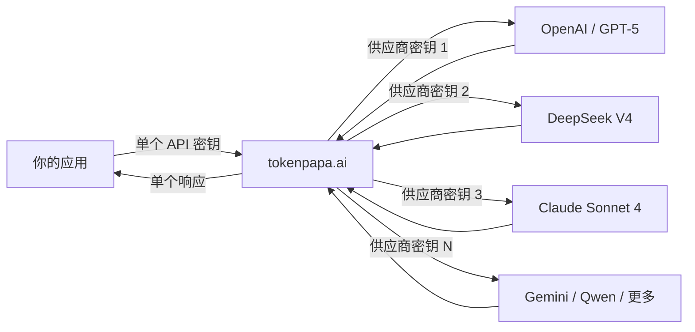

{/* GEO-optimized - 2026-06-28 */}

<JsonLd json='{"@context":"https://schema.org","@type":"Article","headline":"AI API 密钥管理与安全最佳实践 (2026)","description":"2026 年 AI API 密钥安全最佳实践。保护 API 密钥、防止未授权访问、通过 TokenPAPA 安全统一管理多供应商凭证。","datePublished":"2026-06-28","author":{"@type":"Organization","name":"TokenPAPA"}}' />

<JsonLd json='{"@context":"https://schema.org","@type":"FAQPage","mainEntity":[{"@type":"Question","name":"如果我的 AI API 密钥泄露了会怎样？","acceptedAnswer":{"@type":"Answer","text":"AI API 密钥泄露可能导致未授权使用、意外账单（有时数小时内损失数千美元）、攻击者读取对话历史导致数据泄露，以及速率限制耗尽从而阻塞你的正常应用。大多数 AI API 提供商按 token 计费且默认不设支出上限，导致泄露成本极高。必须立即通过供应商面板撤销密钥。使用 TokenPAPA，你可以即时撤销受损的代理密钥并生成新密钥，不影响任何上游供应商账户。"}},{"@type":"Question","name":"如何安全存储多个 AI API 密钥？","acceptedAnswer":{"@type":"Answer","text":"两种最佳方法：(1) 使用像 TokenPAPA 这样的统一 API 网关，将 20 多个独立密钥替换为单个 API 密钥——大幅减少攻击面。(2) 如果单独管理密钥，请存储在环境变量中（切勿写在代码里），使用 AWS Secrets Manager 或 HashiCorp Vault 等机密管理器，添加 .gitignore 条目防止意外提交，每 90 天轮换密钥，并通过告警监控每个密钥的使用情况。团队场景下，为每项服务使用独立密钥并实施 IP 白名单。"}},{"@type":"Question","name":"TokenPAPA 能否改善 API 密钥安全性？","acceptedAnswer":{"@type":"Answer","text":"能。TokenPAPA 将 30 多个供应商专属 API 密钥替换为单个统一 API 密钥，大幅降低密钥攻击面。它提供集中式仪表板用于使用监控和消费告警，支持 IP 白名单，并让你只需轮换一个密钥而非 20 多个。由于你的底层供应商密钥永远不会触及你的应用或源代码，任何单个泄露的爆炸半径都会被限制在一个可控、可撤销的代理密钥内。"}}]}' />

# AI API 密钥管理与安全最佳实践 (2026)

**发布日期：2026 年 6 月 28 日** · **阅读时长：12 分钟**

---

## 1. 引言

每一天，都有开发者在 GitHub 上意外暴露 AI API 密钥，将其粘贴到 Slack 消息中，提交到公共仓库，或留在客户端前端代码里。后果是什么？一个泄露的密钥可能在短短几小时内造成 **数千美元的未授权账单**。

仅 2025 年，安全研究人员就在公开的 GitHub 仓库中发现了超过 **1200 万个唯一的 API 密钥和机密**——而 AI API 密钥在其中占比增长迅猛。与数据库凭证（通常仅授予对静态数据的访问权限）不同，AI API 密钥让攻击者能够使用昂贵的计算资源。一个 GPT-5 或 DeepSeek V4 的 API 密钥泄露，在你察觉之前就可能触发超过 10,000 美元的费用。

本指南涵盖了 **2026 年 AI API 密钥安全的 5 项关键最佳实践**，从基础卫生到企业级防护——并展示了 **[TokenPAPA](https://tokenpapa.ai)** 如何简化整个流程。

> **核心要点：** API 密钥安全不是可选项。鉴于按 token 计费的定价模式以及大多数 AI 提供商默认不设支出上限，密钥泄露不是假设性风险——而是一场等待发生的财务危机。

---

## 2. 常见安全风险

在深入解决方案之前，我们先看看 AI API 密钥最常见的泄露途径。

### 源代码中的密钥暴露

在源文件中硬编码 API 密钥仍然是泄露的头号原因。开发者将代码推送到 GitHub，忘记将配置文件加入 `.gitignore`，几分钟内自动化机器人就会抓取暴露的密钥。GitGuardian 和 truffleHog 等工具持续扫描公共仓库，正是因为这个现象太普遍了。

### 环境文件泄露

`.env` 文件的本意是将机密信息隔离在代码之外——但这些文件本身可能被提交、通过电子邮件分享或粘贴到问题追踪器中。公共仓库中的单个 `.env` 文件就可能一次性暴露多个 AI 供应商的密钥。

### 日志文件与错误输出

作为 URL 查询参数传递、记录在结构化日志中或打印在调试输出中的 API 密钥，最终会进入日志聚合系统（Datadog、Splunk、CloudWatch），被任何拥有日志读取权限的人访问——而这一群体往往比预期的更广。

### 客户端暴露

将 API 密钥嵌入前端 JavaScript、移动应用二进制文件或浏览器扩展中，使其可被轻易提取。任何用户都可以打开开发者工具或反编译你的应用来找到密钥。

### 第三方泄露

当你将 API 密钥存储在共享服务中（CI/CD 管道、协作工具、跨团队共享的密码管理器），其中任何一个服务遭遇安全事件都可能导致所有密钥同时暴露。

### 多供应商管理的复合成本

使用 **5-10 个不同 AI 供应商**（OpenAI、DeepSeek、Anthropic、Google、Cohere、Mistral 等）的开发者最终需要管理同样多的独立 API 密钥。每个密钥都是一个额外的攻击面。每个供应商都有各自的面板、各自的密钥轮换流程、各自的告警系统（或根本没有）。管理 10 多个密钥大大增加了至少其中一个被错误处理的可能性。

---

## 3. 最佳实践 #1：使用统一 API 网关减少密钥面

减少 API 密钥风险最有效的方法是 **减少你需要管理的密钥数量**。每消除一个密钥，就少了一个可能被泄露、窃取或误处理的凭证。

### 单密钥方案

像 **[TokenPAPA](https://tokenpapa.ai)** 这样的统一 API 网关可以将 30 多个供应商专属 API 密钥替换为单个 API 密钥。你的应用只存储和传输一个凭证。



**为什么这有助于安全：**
- **你的底层供应商密钥永远不会进入你的应用代码。** 它们只存在于网关内部，减少了暴露点。
- **密钥轮换变成一次操作。** 轮换一个网关密钥，而不是 20 多个独立的供应商密钥。
- **泄露的爆炸半径被控制。** 泄露的网关密钥可以即时撤销，你的任何上游供应商账户都不会暴露。

### 对比：直接管理密钥 vs. 使用网关

| 方面 | 直接多密钥管理 | TokenPAPA 网关 |
|------|:--------------:|:--------------:|
| **需要管理的 API 密钥** | 10–30+ 个 | **1 个** |
| **需要监控的面板** | 10–30+ 个 | **1 个** |
| **所需轮换频率** | 每个密钥（繁琐） | 单次轮换 |
| **源代码中的供应商密钥** | 全部 10+ 个 | **无** |
| **密钥泄露爆炸半径** | 每个密钥一个供应商 | 限于代理密钥 |
| **费用可见性** | 分散在多个供应商 | **统一仪表板** |

如需查看网关上可用模型和供应商的完整对比，请参阅我们的 [2026 旗舰 LLM 对比](/en/docs/blog/flagship-llm-comparison-2026)。

---

## 4. 最佳实践 #2：环境变量与 .gitignore

无论你使用网关还是直接管理密钥，**切勿在源文件中硬编码 API 密钥**。

### 正确做法

```bash
# .env（切勿提交此文件）
TOKENPAPA_API_KEY=sk-tp-...此处填写
OPENAI_API_KEY=sk-你的...-key
DEEPSEEK_API_KEY=sk-你的...-key
```

```python
import os
from dotenv import load_dotenv

load_dotenv()

# 从环境变量读取，绝不硬编码
client = OpenAI(
    api_key=os.getenv("TOKENPAPA_API_KEY"),
    base_url="https://api.tokenpapa.ai/v1"
)
```

### 必备的 .gitignore 条目

```text
# API 密钥和机密
.env
.env.*
*.key
secrets/
credentials.*
**/service-account.json
**/*-key.json
```

### 常见陷阱与避免方法

| ❌ 不要做 | ✅ 应该做 |
|----------|----------|
| 提交 `.env` 文件 | 在首次提交前将 `.env` 加入 `.gitignore` |
| 通过 Slack、邮件或 Notion 分享密钥 | 使用机密管理器或加密保险库 |
| 将密钥存储在 `settings.py` 或 `config.json` 中 | 仅从环境变量读取 |
| 记录 API 密钥用于调试 | 在所有日志输出中清理密钥 |
| 在截图中粘贴密钥 | 在分享的任何图片中模糊或涂掉密钥 |

### 预提交钩子

使用 `pre-commit` 配合 `detect-secrets` 或 `truffleHog` 等工具，在每次提交到达仓库前自动扫描 API 密钥：

```bash
# 安装 pre-commit 和机密检测器
pip install pre-commit detect-secrets
detect-secrets scan > .secrets.baseline
pre-commit install
```

---

## 5. 最佳实践 #3：密钥轮换与过期

API 密钥是长期有效的凭证。密钥存在时间越长，泄露的可能性就越高。**定期轮换可以限制暴露窗口。**

### 轮换指南

- **每 90 天轮换生产环境密钥**作为基线。
- **在发生任何疑似泄露、人员变动或日志暴露后立即轮换。**
- **为开发、预发布和生产环境使用不同的密钥**，这样开发密钥泄露不会影响生产环境。

### 自动化轮换

使用独立供应商时，密钥轮换意味着：
1. 在供应商 A 的面板上生成新密钥
2. 更新你的部署机密
3. 验证新密钥可用
4. 撤销旧密钥
5. 对供应商 B、C、D……重复以上步骤

使用 **TokenPAPA**，轮换只需在一个面板上执行一次操作。生成新的网关密钥，更新一个环境变量，就完成了——你的底层供应商密钥保持不变。

### 过期策略

某些 AI 供应商不原生支持密钥过期。如果你的供应商支持，请为临时工作负载、CI/CD 管道和预发布环境设置密钥过期日期。对于不支持过期的供应商，将轮换作为你的主要控制手段。

### 不轮换的成本

| 场景 | 影响 |
|------|------|
| 密钥通过 CI/CD 日志泄露 | 未授权计费持续到手动撤销密钥 |
| 前员工保留密钥访问权限 | 离职后仍继续使用 |
| 已提交的 `.env` 文件中的密钥被机器人抓取 | 凭证填充机器人立即自动化滥用 |
| 一年前项目中的未轮换密钥 | 被遗忘的密钥仍处于激活状态并消耗预算 |

如果你正在根据定价和安全性评估供应商，请参阅我们的 [2026 LLM API 定价对比](/en/docs/blog/llm-api-pricing-comparison-2026) 获取详细分析。

---

## 6. 最佳实践 #4：速率限制与使用监控

即使预防措施做得再好，密钥仍有可能被入侵。**检测是你的第二道防线。**

### 设置使用告警

大多数 AI 供应商允许你设置支出限制和使用告警，但实现方式差异很大：

| 供应商 | 默认支出上限 | 实时告警 | 按密钥监控 |
|-------|:------------:|:--------:|:----------:|
| OpenAI | ❌ 无上限 | ✅ 邮件告警 | ⚠️ 通过面板 |
| DeepSeek | ❌ 无上限 | ⚠️ 有限 | ❌ 不支持 |
| Anthropic | ❌ 无上限 | ✅ 邮件告警 | ⚠️ 基础功能 |
| Google Gemini | ❌ 无上限 | ✅ 邮件告警 | ⚠️ 通过 GCP |
| **TokenPAPA** | ✅ 可配置 | ✅ 实时告警 | ✅ 按密钥仪表板 |

### 监控什么

**异常使用模式**是密钥被入侵的最早信号：
- **请求量或 token 消耗的突然激增**
- **来自异常地理区域的请求**（例如你的应用运行在 us-east-1，但 API 调用来自东欧）
- **调用你从未使用过的模型**（攻击者通常会先用昂贵模型进行试探）
- **非正常时段的请求**——被入侵的密钥通常在抓取后立即被测试

### 实施速率限制

速率限制不只是为了防止滥用——更是为了**限制密钥泄露的财务损失**：

```python
from openai import OpenAI
import time

client = OpenAI(
    api_key="***",
    base_url="https://api.tokenpapa.ai/v1"
)

# 客户端速率限制（补充服务端限制）
MAX_RPM = 60  # 每分钟最大请求数
request_times = []

def rate_limited_request(messages, model="deepseek-v4"):
    now = time.time()
    # 移除超过 60 秒的请求记录
    request_times[:] = [t for t in request_times if now - t < 60]
    if len(request_times) >= MAX_RPM:
        sleep_time = 60 - (now - request_times[0])
        time.sleep(sleep_time)
    request_times.append(time.time())
    return client.chat.completions.create(
        model=model,
        messages=messages
    )
```

### TokenPAPA 监控仪表板

使用 TokenPAPA，你的所有使用数据都在一个仪表板中可见——请求量、token 消耗、按模型划分的支出、错误率和延迟。设置消费阈值，一旦检测到异常活动，立即通过邮件、Slack 或 Webhook 收到通知。

> **专业提示：** 首次集成新供应商时，设置一个较低的消费告警（例如每天 10 美元）。等你了解自己的使用模式后再提高阈值。

---

## 7. 最佳实践 #5：IP 白名单与访问控制

API 密钥安全中最具限制性的层面是**控制密钥可以在何处使用。**

### IP 白名单

许多 AI 供应商和网关允许你将 API 密钥限制在特定的 IP 地址或 CIDR 范围内。这意味着即使密钥泄露，也无法从未授权的网络使用。

```yaml
# 示例 IP 白名单配置
allowed_ips:
  - 10.0.0.0/8        # 内部企业网络
  - 203.0.113.0/24    # 办公室 VPN
  - 192.0.2.50/32     # CI/CD 运行器
```

**IP 白名单最佳实践：**
- 仅将你的应用实际使用的 IP 范围加入白名单。
- 对于服务端应用，将云提供商的 NAT 网关 IP 加入白名单。
- 对于无服务器函数（AWS Lambda、Vercel Edge），使用提供商公布的出口 IP 范围。
- **避免将 0.0.0.0/0 或大范围公共 IP 加入白名单**——那样会失去白名单的意义。

### 服务级访问控制

对于团队来说，API 密钥管理不仅关乎外部威胁。内部访问控制可以防止一个团队的开发者意外（或故意）消耗分配给另一个团队的预算。

- **为每项服务或环境使用独立的密钥。** 移动应用后端使用的密钥不应与分析管道使用的密钥相同。
- **实施最小权限原则。** 每个密钥只应有权访问它需要的模型和功能。
- **定期审计密钥使用情况。** 检查哪些密钥处于激活状态、谁有权访问、以及是否仍有必要。

### TokenPAPA IP 限制

TokenPAPA 在 API 密钥级别支持 IP 白名单，因此你可以将每个密钥限制在特定的 CIDR 范围内。结合单密钥架构，这让你以最小的管理开销获得企业级的访问控制。

对于管理多个项目和供应商的团队，请参阅我们的 [面向独立开发者与小团队的 LLM API 指南](/en/docs/blog/llm-apis-for-indie-hackers)。

---

## 8. TokenPAPA 如何简化 API 安全

在 5 个、10 个或 20 多个 AI 供应商之间管理 API 密钥是一种安全负担。**[TokenPAPA](https://tokenpapa.ai)** 从设计之初就是为了解决这个问题。

### 单一统一 API 密钥

无需再为 DeepSeek、OpenAI、Anthropic、Google、Cohere、Mistral 以及 25 个以上其他供应商切换凭证——你只需管理 **一个 API 密钥**。这个单密钥兼容 OpenAI SDK，让你的代码保持简洁，安全面保持最小。

### 集中式仪表板

| 功能 | 作用 |
|------|------|
| **使用监控** | 实时查看所有供应商的请求量、token 和消费情况，一个视图尽收眼底 |
| **消费告警** | 可配置阈值，支持邮件、Slack 和 Webhook 通知 |
| **按密钥分析** | 按模型、供应商、时间段和错误率进行细分 |
| **密钥管理** | 在一个界面中生成、轮换和撤销密钥 |
| **IP 白名单** | 将每个密钥限制在特定的 IP 范围内 |

### 安全架构

你底层的供应商 API 密钥永远不会离开 TokenPAPA 的基础设施。你的应用只使用 TokenPAPA 代理密钥。这意味着：

- 泄露的代理密钥可以撤销而不影响上游供应商账户。
- 供应商密钥可以在 TokenPAPA 端轮换，无需你更改任何代码。
- 你的环境变量、构建产物或部署配置中不存在任何供应商凭证。

### 即时告警

TokenPAPA 的监控系统能够检测异常使用模式并发送实时告警。来自异常地理区域的 token 消耗突然激增会立即触发通知——让你在账单影响变得严重之前有时间撤销密钥。

### 60 秒内快速上手

1. 在 **[tokenpapa.ai](https://tokenpapa.ai)** 注册——无需电话验证，无需上传身份证明。
2. 从仪表板生成一个 API 密钥。
3. 将你所有独立的供应商密钥替换为这一个密钥。
4. 设置消费告警并配置 IP 白名单。
5. 完成。你的攻击面已从 30 多个密钥减少到一个。

---

## 9. 常见问题

### Q1：如果我的 AI API 密钥泄露了会怎样？

AI API 密钥泄露可能导致未授权使用、意外账单（有时数小时内损失数千美元）、攻击者读取对话历史导致数据泄露，以及速率限制耗尽从而阻塞你的正常应用。大多数 AI API 提供商按 token 计费且默认不设支出上限，导致泄露成本极高。必须立即通过供应商面板撤销密钥。使用 TokenPAPA，你可以即时撤销受损的代理密钥并生成新密钥，不影响任何上游供应商账户。

### Q2：如何安全存储多个 AI API 密钥？

两种最佳方法：(1) 使用像 TokenPAPA 这样的统一 API 网关，将 20 多个独立密钥替换为单个 API 密钥——大幅减少攻击面。(2) 如果单独管理密钥，请存储在环境变量中（切勿写在代码里），使用 AWS Secrets Manager 或 HashiCorp Vault 等机密管理器，添加 `.gitignore` 条目防止意外提交，每 90 天轮换密钥，并通过告警监控每个密钥的使用情况。团队场景下，为每项服务使用独立密钥并实施 IP 白名单。

### Q3：TokenPAPA 能否改善 API 密钥安全性？

能。TokenPAPA 将 30 多个供应商专属 API 密钥替换为单个统一 API 密钥，大幅降低密钥攻击面。它提供集中式仪表板用于使用监控和消费告警，支持 IP 白名单，并让你只需轮换一个密钥而非 20 多个。由于你的底层供应商密钥永远不会触及你的应用或源代码，任何单个泄露的爆炸半径都会被限制在一个可控、可撤销的代理密钥内。

---

## 准备好保护你的 AI API 访问了吗？

别再管理 30 多个 API 密钥了。从一个开始。

**[免费试用 TokenPAPA →](https://tokenpapa.ai)**

无需电话验证。无需信用卡即可开始。兼容 DeepSeek V4、GPT-5、Claude Sonnet 4、Gemini 2.5 Pro、Qwen 以及 30 多个其他模型——全部通过一个可安全管理的 API 密钥。

如需进一步阅读，请浏览我们的 [2026 最佳 LLM API 对比](/en/docs/blog/best-llm-api-2026-comparison) 和 [2026 旗舰 LLM 对比](/en/docs/blog/flagship-llm-comparison-2026)，了解各大模型之间的对比情况。
